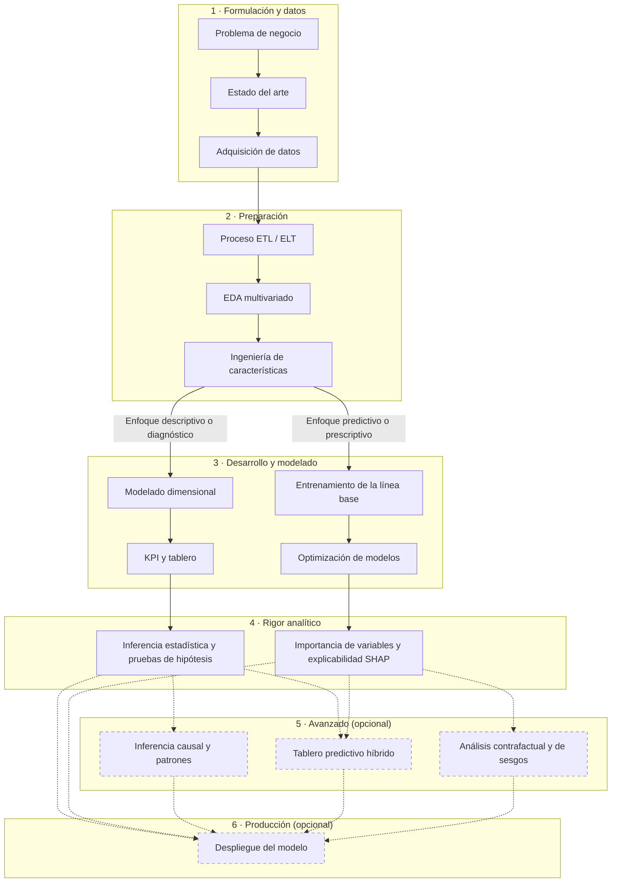

# Ruta para proyectos y tesis de analítica de datos

Usa esta ruta como guía de trabajo y adáptala al alcance de tu especialización o maestría. Se apoya en CRISP-DM; la evaluación y las iteraciones acompañan todo el proceso. Cada programa define sus requisitos y su formato de entrega.

*Figura. Ruta del proyecto basada en CRISP-DM. Las etapas 1 a 4 son la base de todo proyecto; la profundidad técnica de las etapas 2 a 4 es lo que lo hace sólido. Las etapas 5 y 6 (líneas punteadas) son opcionales y elevan el nivel del trabajo.*

Para usar esta figura en tu documento, copia el bloque de código en [mermaid.live](https://mermaid.live/), adáptalo a tu proyecto y descárgalo como PNG o SVG. Declara CRISP-DM como metodología e incluye la ruta adaptada.

| Etapa | Qué desarrollas | Evidencia útil | Momento de trabajo |
| --- | --- | --- | --- |
| 1. Formulación y datos | Problema, pregunta, objetivos, antecedentes y adquisición de datos | Planteamiento, ficha del dataset, diccionario y protocolo | Hito 1 |
| 2. Preparación | ETL/ELT, análisis exploratorio y características | Cuaderno reproducible, conteos antes/después y bitácora | Hitos 1 y 2 |
| 3. Desarrollo | Modelos predictivos o modelo dimensional, KPI y tablero | Línea base, comparación de modelos o tablero validado | Hito 2 |
| 4. Evaluación y rigor | Incertidumbre, comparación, explicabilidad y discusión | Tablas, figuras, pruebas justificadas y limitaciones | Hito 3 |
| 5. Profundización | Contrafactuales, equidad o inferencia causal si la pregunta y los datos lo permiten | Análisis con supuestos explícitos | Según alcance |
| 6. Uso y despliegue | Aplicación, API, tablero o guía de decisiones | Producto verificable y documentación | Según alcance |

## Elige el camino de tu proyecto

- **Predictivo:** define qué se predice, cuándo se predice, qué variables estarán disponibles y cómo se compara con una línea base.
- **Descriptivo o de inteligencia de negocios:** define las decisiones, los indicadores, las dimensiones de análisis y cómo validarás los totales y la utilidad del tablero.
- **Maestría:** acuerda con tu director el aporte de investigación esperado, la profundidad de los antecedentes y la estrategia para evaluar la contribución.

No necesitas aplicar todas las técnicas del catálogo. Cada técnica debe responder una pregunta y sostenerse con los datos y los supuestos de tu proyecto.

## Trabaja por hitos

1. [Datos y preparación](hito-1-datos-y-preparacion.md): plantea el problema y fija el protocolo antes de modelar.
2. [Desarrollo y modelado](hito-2-modelado.md): construye, compara y documenta.
3. [Resultados y discusión](hito-3-resultados-y-discusion.md): verifica, interpreta y prepara la defensa.

Estos hitos organizan el avance; sus fechas y condiciones se acuerdan con el director de cada proyecto.

[Volver al inicio](../README.md)
